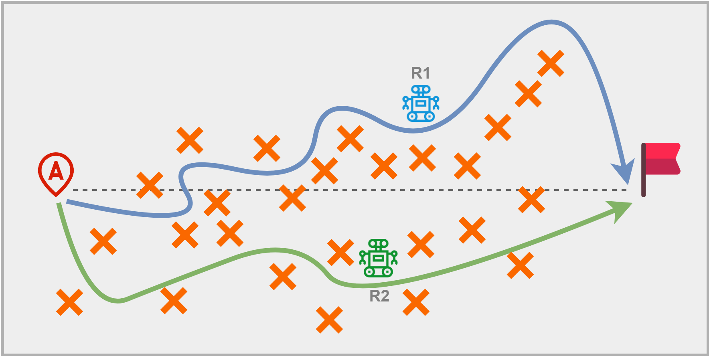
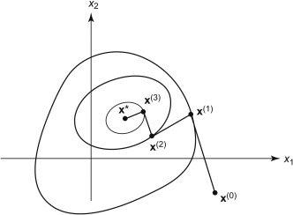
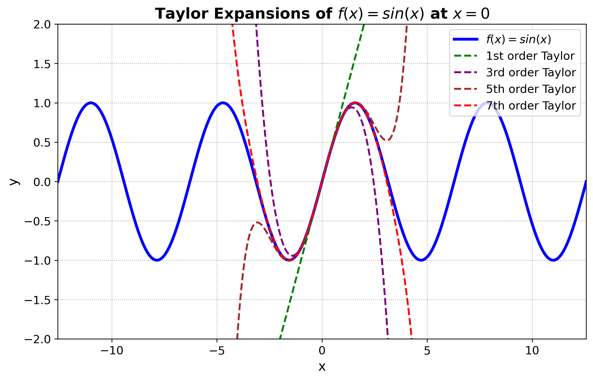

## 累计局部最优VS全局最优 —— 从Taylor展开的上帝视角直观理解

知乎原文链接：[https://zhuanlan.zhihu.com/p/9665060052](https://zhuanlan.zhihu.com/p/9665060052)

过去我们常常听到一个问题：**人生的每一步都走到了局部最优，是否意味着实现了全局最优？**  
在经过不长的思考后，大家总会给出答案：**No**。然而，不知道有多少童鞋会进一步思考：这是什么原因导致的？  

我们不妨从一个常见的机器人导航场景来引入：

有两个Robot \( R_1 \)、\( R_2 \) 分别从A点出发，目标是以最短路径无碰撞地到达终点。在这个问题中，\( R_1 \) 采取的就是局部最优策略：既然终点就在我的水平方向，那我只需要沿着水平方向走，尽可能减小竖直方向的运动。我们可以看到，在起步阶段，\( R_1 \) 由于沿着水平虚线前进，的确相较于\( R_2 \) 更接近终点。然而在路程的中后段，我们发现\( R_1 \) 水平方向的轨迹上存在大量障碍物，因此不得不绕行，最终绕了一个大弯才抵达终点，这个过程中\( R_1 \) 自己也人为它的每一步都走在了当前时刻的最优解。而相比之下，\( R_2 \) 虽然一开始落后于\( R_1 \)，但是这条路径存在的障碍物更少，更快地到达了终点。（这里来一点成功学鸡汤：人生起步慢一点走些弯路没关系，只要一直朝着目标，也许会更快到达终点。）

那么，为什么\( R_1 \) 一开始就不知道从下面绕过去？这个答案非常明显，就是：**\( R_1 \) 的视野仅仅支持它看到不远的前方，因为没开上帝视角不知道全局地图，当然就只能在有限的视野下，做出它认为最优的决定**。

所以，回答我们最初的问题：正是因为我们每个人的视野有限，只能看到短期的未来，所以我们只能走到局部最优。当你打开上帝视角，回顾自己的一生才会发出和我们刚才一样的疑问，为什么当初你没有做出那个决定？

So，这篇文章的成功学部分已经结束了，我们接下来进入正题：**有限视野是导致累计局部最优不等于全局最优的原因**，这个结论可以从数学上证明或者解释吗？ 答案是可以！

而实际上这个哲学的命题，居然和Taylor展开有着密切的关系！而你只需要知道什么是Taylor展开，其证明过程一个中学生就能看懂！读完这篇文章，你还将更深入地理解最优化理论中的最速下降法、牛顿法。

后面的内容涉及一点数学证明，如果熟悉最速下降法的童鞋可以直接跳到Taylor展开的Section。

首先，我们来考虑一个通过**迭代运算求函数极小点**的问题：

现在你有一个函数的初始点 \( x^{(0)} \)，你想在 \( x^{(0)} \) 的基础上沿着某个方向 \( d_{0} \) 前进一定的步长 \( \lambda_{0} \)，得到新的点 \( x^{(1)} \)：

\[
x^{(1)} = x^{(0)} + \lambda_{0} d^{(0)}
\]

然后重复这个过程，令： \( x^{(k+1)} = x^{(k)} + \lambda_k d^{(k)} \)。你希望最终的迭代的结果最好是能收敛到极小值 \( f(x^\ast ) \)，而要实现这个目的，就要保证前进的方向 \( d^{(k)} \) 和走的步长 \( \lambda_{k} \) 能带你奔着极小点去，不会跑飞。

而我们知道：函数的梯度 \( f\left(x^{(k)}\right) \) 代表函数值增长最快的方向，所以我们的 \( d^{(k)} \) 只要沿着当前的负梯度方向，就能保证函数下降：

\[
d^{(k)} = -\nabla f\left(x^{(k)}\right)
\]

于是，设定好了前进方向，最后我们还需要选择合适的步长 \( \lambda \)，最理想的步长 \( \lambda_{k} \) 当然是沿着当前方向一直走到函数值最小的距离：

\[
f\left(x^{(k)} + \lambda_{k} d^{(k)}\right) = \min_{\lambda \geq 0} f\left(x^{(k)} + \lambda d^{(k)}\right)
\]

以上就是我们就得到了迭代算法，这就是**最速下降法**。

因为最速下降法就是保证每一步都局部最优的算法（方向取的是函数值下降最快的方向，步长是沿当前方向走到得函数值最小的步长）可以说非常local了，那么它的性能如何？

我们来看最终的收敛效果：

你会发现，这种迭代算法会使每一次 \( x \) 的迭代方向和前一次都正交，导致越靠近极值点，收敛越慢。

证明过程比较容易：

令： \( \varphi(\lambda) = f\left(x^{(k)} + \lambda d^{(k)}\right) \)，

\[
d^{(k)} = -\nabla f\left(x^{(k)}\right)
\]

为求出从 \( x^{(k)} \) 出发沿方向 \( d^{(k)} \) 的极小点，令：

\[
\varphi'(\lambda_k) = \nabla f\left(x^{(k)} + \lambda_k d^{(k)}\right)^T d^{(k)} = 0
\]

得：

\[
-\nabla f\left(x^{(k+1)}\right)^T \nabla f\left(x^{(k)}\right) = 0
\]

所以 \( d^{(k+1)} = -\nabla f\left(x^{(k+1)}\right) \) 与 \( d^{(k)} = -\nabla f\left(x^{(k)}\right) \) 正交

**关键来了：**

**为什么方向和步长都取得局部最优，得到的搜索路径却不是全局最优的路径呢**（可以考虑全局最优的搜索路径是从 \( x^{(0)} \) 到 \( x^\ast \) 的连线）？

这就跟Taylor展开有关：

我们选择下降最快的负梯度方向作为搜索方向其实是默认了一个隐含条件：将Taylor展开中的线性项作为了目标函数的近似，即：

\[
-\nabla f\left(x^{(k)}\right) = \arg\min \left\{ f\left(x^{(k)}\right) + d^T \nabla f\left(x^{(k)}\right) \mid \|d\| \leq 1 \right\}
\]

\[
f\left(x^{(k)} + d\right) = f\left(x^{(k)}\right) + d^T \nabla f\left(x^{(k)}\right) + o\left(d\right)
\]

那么，大家有没有发现一个矛盾：我们**用最不准确的拟合方式，却能得到最快的下降方向**。

我们从Taylor展开式的图像入手来解释这个问题，以 \( x=0 \) 处 \( \sin x \) 的Taylor展开为例：

**当我们只保留一阶时，得到的近似图像 \( y=x \) 仅保留了该点函数的变化方向，局部性最强。而当展开项数越多，其拟合的全局性越好，以高阶导数作为梯度方向就会"兼顾"该点周围的变化，所以这种全局的变化越丰富，其在该点的表征能力越弱，对更远处的表征能力越强。**

所以，这种最不准确的线性拟合方式反而最能反应函数值在该点的变化。然而，我们在使用最速下降法迭代时，其关注的永远只是当前时刻或者当前点的梯度，而这个点的
